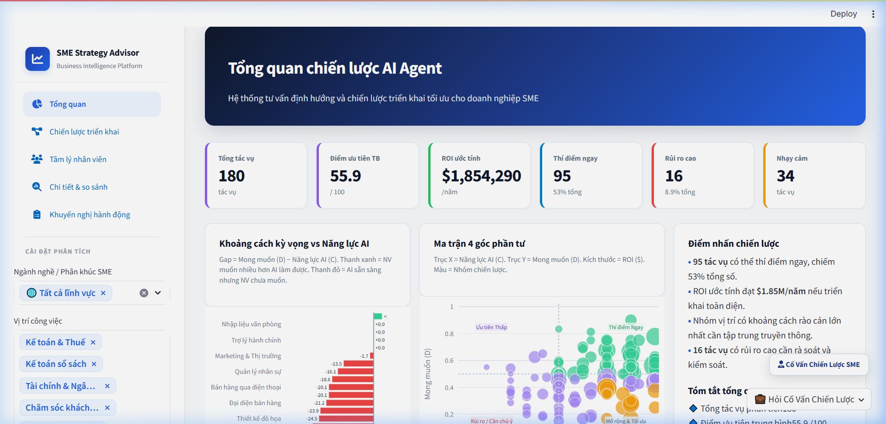
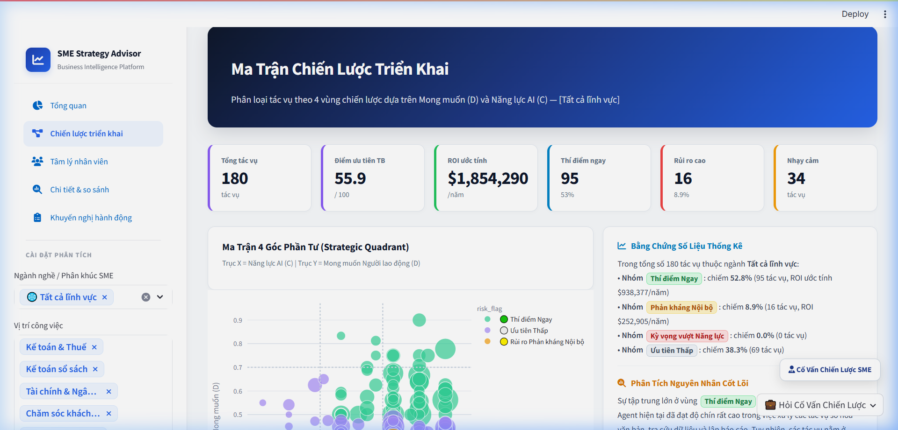
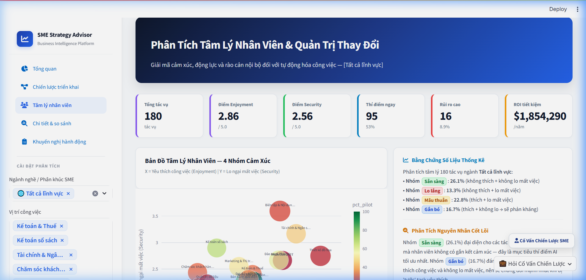
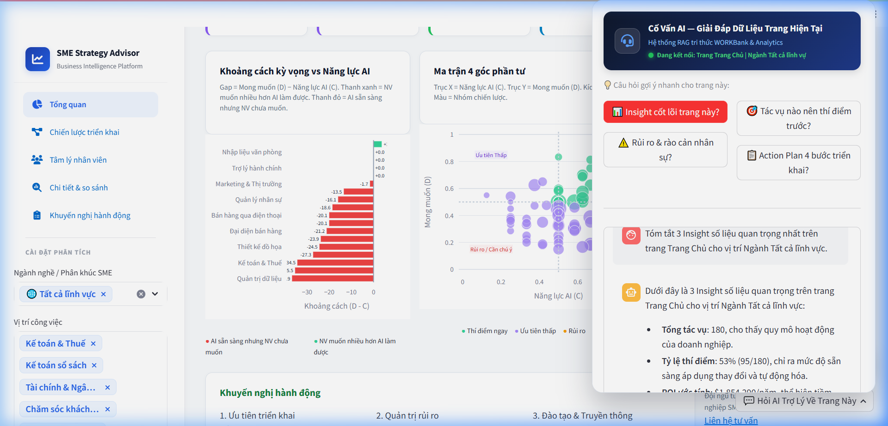
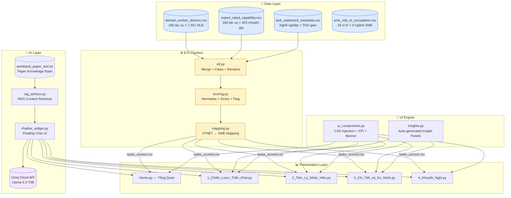
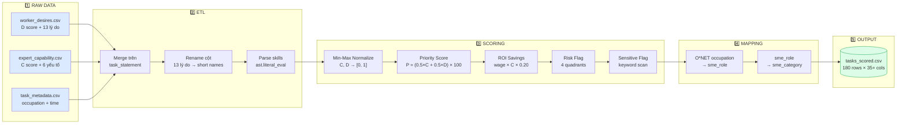
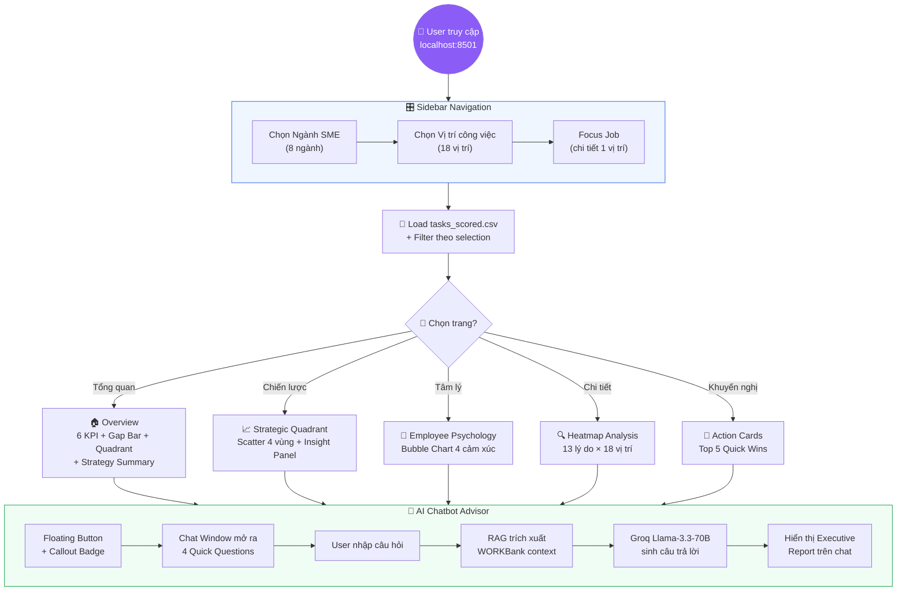
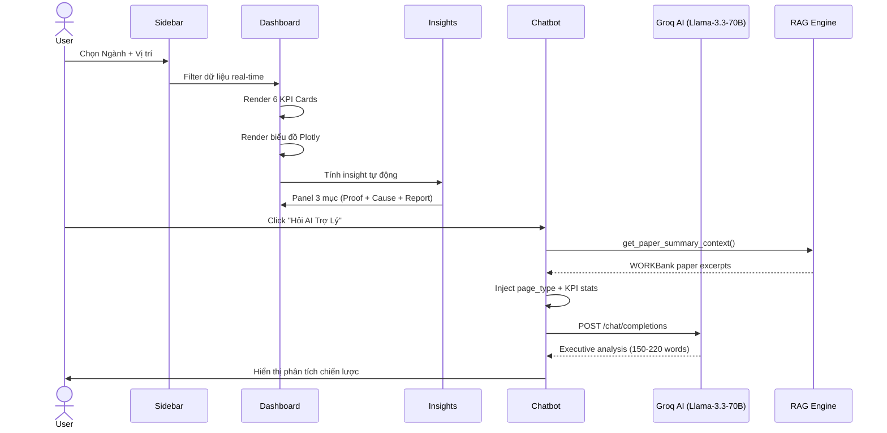
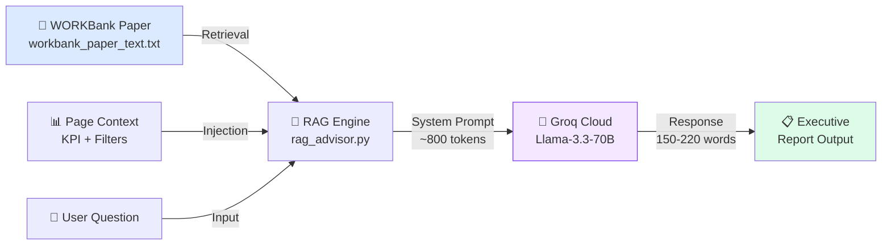

<p align="center">
  
  
  
  
  
  
</p>

<h1 align="center">📊 SME Strategy Advisor</h1>
<h3 align="center">Business Intelligence Platform for AI Agent Adoption in SMEs</h3>

<p align="center">
  <em>Hệ thống tư vấn chiến lược triển khai AI Agent cho doanh nghiệp vừa & nhỏ — dựa trên bộ dữ liệu nghiên cứu WORKBank (Stanford SALT Lab & Harvard)</em>
</p>

---

## 📋 Mục Lục

- [Tổng Quan](#-tổng-quan)
- [Demo & Screenshots](#-demo--screenshots)
- [Kiến Trúc Hệ Thống](#-kiến-trúc-hệ-thống)
- [Quy Trình Dữ Liệu (Data Pipeline)](#-quy-trình-dữ-liệu-data-pipeline)
- [Workflow Ứng Dụng](#-workflow-ứng-dụng)
- [Cấu Trúc Thư Mục](#-cấu-trúc-thư-mục)
- [Kỹ Thuật Sử Dụng](#-kỹ-thuật-sử-dụng)
- [Cài Đặt & Chạy](#-cài-đặt--chạy)
- [Biến Môi Trường](#-biến-môi-trường)
- [Dashboard Chi Tiết](#-dashboard-chi-tiết)
- [AI Chatbot Advisor](#-ai-chatbot-advisor)
- [Deploy Lên Streamlit Cloud / Vercel](#-deploy)
- [Tài Liệu Tham Khảo](#-tài-liệu-tham-khảo)
- [License](#-license)

---

## 🎯 Tổng Quan

**SME Strategy Advisor** là hệ thống Business Intelligence Dashboard giúp doanh nghiệp vừa & nhỏ (SME) tại Việt Nam đưa ra quyết định **dựa trên dữ liệu** (Data-Driven Decision Making) khi triển khai AI Agent tự động hóa công việc.

### Vấn đề cần giải quyết

| Thách thức | Giải pháp |
|---|---|
| SME không biết nên tự động hóa tác vụ nào trước | Ma trận 4 Góc phần tư phân loại 180 tác vụ |
| Không ước lượng được ROI tiết kiệm | Mô hình tính ROI = Thời gian × Lương × C |
| Lo ngại nhân viên phản đối thay đổi | Bản đồ Tâm lý 4 nhóm cảm xúc + Change Management |
| Nhà quản trị không đọc được biểu đồ | AI Chatbot RAG giải thích insight 24/7 |

### Tính năng nổi bật

- 🏢 **5 trang Dashboard** phong cách Power BI / Notion / Stripe
- 📊 **7 metrics định lượng** với công thức toán học rõ ràng
- 🤖 **AI Chatbot Floating** (Llama-3.3-70B + RAG) tư vấn chiến lược trực tiếp trên Dashboard
- 🎛️ **3 bộ lọc tương tác** (Ngành nghề, Vị trí, Focus Job) cập nhật real-time
- 📈 **5 loại biểu đồ** Plotly tương tác: Diverging Bar, Scatter Quadrant, Bubble, Heatmap, Histogram
- 🗂️ **Bảng dữ liệu gốc**: WORKBank Research Dataset (Stanford SALT Lab, arXiv:2506.06576v3)

---

## 🖼️ Demo & Screenshots

### Trang Chủ — Tổng Quan Dashboard


### Ma Trận Chiến Lược 4 Góc Phần Tư


### Bản Đồ Tâm Lý Nhân Viên


### AI Chatbot Advisor


---

## 🏗️ Kiến Trúc Hệ Thống



---

## 🔄 Quy Trình Dữ Liệu (Data Pipeline)



### Công thức Scoring chi tiết

| Metric | Công thức | Thang đo |
|---|---|---|
| Normalized C | `(c_raw − 1.0) / (5.0 − 1.0)` | 0.00 – 1.00 |
| Normalized D | `(d_raw − 1.0) / (5.0 − 1.0)` | 0.00 – 1.00 |
| Priority Score | `(0.5 × C + 0.5 × D) × 100` | 0 – 100 |
| ROI Savings | `annual_wage × C × 0.20` | USD/năm |
| Technical Complexity | `(phys×0.3 + unc×0.35 + dom×0.35) / 5.0 × 10` | 0 – 10 |
| Time Saving | `C × 40%` | % |

### Phân loại 4 Vùng Chiến Lược (Risk Flag)

| Vùng | Điều kiện | Mô hình AI | Số tác vụ |
|---|---|---|---|
| 🟢 Thí điểm Ngay | D ≥ 0.5 & C ≥ 0.5 | Full Automation | 95 (52.8%) |
| 🟡 Phản kháng Nội bộ | C > 0.7 & D < 0.4 | Copilot | 16 (8.9%) |
| 🟠 Kỳ vọng vượt Năng lực | D > 0.7 & C < 0.4 | RAG Agent | 0 (0%) |
| ⚪ Ưu tiên Thấp | Còn lại | Chưa ưu tiên | 69 (38.3%) |

---

## 🔁 Workflow Ứng Dụng



### User Flow chi tiết



---

## 📁 Cấu Trúc Thư Mục

```
SME-Strategy-Advisor/
│
├── 📄 README.md                          # Documentation (file này)
├── 📄 requirements.txt                   # Python dependencies
├── 📄 .streamlit/
│   └── config.toml                       # Streamlit theme config
│
├── 📂 app/                               # ── PRESENTATION LAYER ──
│   ├── Home.py                           # 🏠 Trang Chủ (Tổng Quan Dashboard)
│   ├── components/
│   │   └── ui_components.py              # 🎨 CSS Injection + KPI Cards + Banners
│   └── pages/
│       ├── 1_Chiến_Lược_Triển_Khai.py    # 📈 Ma Trận 4 Góc Phần Tư
│       ├── 2_Tâm_Lý_Nhân_Viên.py        # 👥 Bản Đồ Tâm Lý Nhân Viên
│       ├── 3_Chi_Tiết_và_So_Sánh.py      # 🔍 Heatmap Phân Bố Lý Do
│       └── 4_Khuyến_Nghị.py              # 🎯 Recommendation Cards
│
├── 📂 src/                               # ── BUSINESS LOGIC LAYER ──
│   ├── etl.py                            # 🔄 Extract-Transform-Load pipeline
│   ├── scoring.py                        # 📐 Scoring + Risk Flag + ROI
│   ├── mapping.py                        # 🗺️ O*NET → SME Role Mapping + Sidebar
│   ├── insights.py                       # 💡 Auto-generated Insight Engine
│   ├── utils.py                          # 🛠️ Utility functions (load data)
│   ├── rag_advisor.py                    # 📚 RAG Engine (WORKBank paper)
│   └── chatbot_widget.py                 # 🤖 Floating AI Chatbot Widget
│
├── 📂 data/                              # ── DATA LAYER ──
│   ├── domain_worker_desires.csv         # Worker desire scores (7,451 ratings)
│   ├── expert_rated_technological_capability.csv  # Expert capability scores (453 experts)
│   ├── task_statement_with_metadata.csv  # Task metadata (occupation, time, wage)
│   ├── workbank_paper_text.txt           # WORKBank paper text for RAG
│   ├── mapping/
│   │   └── sme_role_to_occupation.csv    # 18 SME roles → O*NET occupations
│   └── processed/
│       └── tasks_scored.csv              # ⭐ Final scored dataset (180 × 35+ cols)
│
└── 📂 docs/                              # ── DOCUMENTATION ──
    └── screenshots/                      # Dashboard screenshots for README
```

---

## 🛠️ Kỹ Thuật Sử Dụng

### Tech Stack

| Layer | Technology | Vai trò |
|---|---|---|
| **Frontend** | Streamlit 1.35+ | Web framework, multipage routing |
| **UI/UX** | Custom CSS Injection | Power BI / Notion / Stripe design system |
| **Charts** | Plotly 5.x (Express + Graph Objects) | Interactive visualizations |
| **Icons** | Font Awesome 6.5 (CDN) | Navigation + KPI icons |
| **Backend** | Python 3.10+ | Data processing + API calls |
| **Data** | Pandas + NumPy | ETL pipeline + statistical computation |
| **AI Model** | Llama-3.3-70B-Versatile | Chatbot response generation |
| **AI Infra** | Groq Cloud API | Ultra-fast LLM inference (~200ms) |
| **RAG** | Custom text retrieval | WORKBank paper knowledge extraction |
| **Report** | python-docx | Automated Word report generation |

### Kỹ Thuật Trực Quan Hóa

| Biểu đồ | Thư viện | Kỹ thuật | Mục đích |
|---|---|---|---|
| Diverging Bar Chart | `plotly.graph_objects.Bar` | Horizontal bar, dual-color encoding | So sánh Gap (D−C) giữa 18 vị trí |
| Scatter Quadrant | `plotly.express.scatter` | Size = ROI, Color = Risk Flag | Phân loại 4 vùng chiến lược |
| Bubble Chart | `plotly.express.scatter` | Size = time, Color = % pilot | Bản đồ 4 nhóm cảm xúc |
| Heatmap | `plotly.express.imshow` | RdYlGn color scale | Phân bố 13 lý do × 18 vị trí |
| Histogram | `plotly.express.histogram` | Bin distribution | Phân bố Priority Score |

### Kỹ Thuật UI/UX Nâng Cao

- **CSS Injection**: Toàn bộ giao diện Streamlit được override bằng `st.markdown()` với `unsafe_allow_html=True` — tạo ra Sidebar 4 vùng cố định, KPI Cards bo tròn có viền màu, Hero Banner gradient, và layout responsive
- **Glassmorphism**: Background sidebar sử dụng `backdrop-filter: blur()` tạo hiệu ứng kính mờ
- **Micro-animations**: CSS `@keyframes` cho Float Bounce (chatbot badge), Pulse Glow (chat button), Shimmer (KPI cards)
- **Font Awesome Integration**: Nhúng CDN Font Awesome 6.5 để render 20+ icon chuyên nghiệp

### Kỹ Thuật AI/ML

- **RAG (Retrieval-Augmented Generation)**: Module `rag_advisor.py` đọc toàn văn bài báo WORKBank → trích xuất ngữ cảnh 3,500 + 2,500 ký tự → inject vào system prompt
- **Context-Aware Chatbot**: Mỗi trang truyền `page_type`, `job_name`, `category_name`, `stats_summary` → AI hiểu đang nói về trang nào, vị trí nào
- **Conversation Memory**: Lưu 6 tin nhắn gần nhất trong `st.session_state` cho multi-turn dialog
- **Prompt Engineering**: System prompt dài ~800 token, role-play Senior Strategy Advisor, output format C-Level Executive Report

---

## 🚀 Cài Đặt & Chạy

### Yêu cầu hệ thống

- Python ≥ 3.10
- pip (Python package manager)
- Trình duyệt web hiện đại (Chrome, Firefox, Edge)

### Cài đặt

```bash
# 1. Clone repository
git clone https://github.com/<your-username>/sme-strategy-advisor.git
cd sme-strategy-advisor

# 2. Tạo virtual environment (khuyến nghị)
python -m venv venv
source venv/bin/activate        # Linux/Mac
venv\Scripts\activate           # Windows

# 3. Cài đặt dependencies
pip install -r requirements.txt

# 4. Thiết lập biến môi trường
export GROQ_API_KEY="gsk_your_api_key_here"    # Linux/Mac
set GROQ_API_KEY=gsk_your_api_key_here         # Windows CMD
$env:GROQ_API_KEY="gsk_your_api_key_here"      # Windows PowerShell
```

### Chạy ứng dụng

```bash
# Chạy Streamlit development server
streamlit run app/Home.py --server.port 8501

# Mở trình duyệt tại:
# http://localhost:8501
```

### Requirements

```txt
streamlit>=1.35.0
pandas>=2.0.0
numpy>=1.24.0
plotly>=5.18.0
groq>=0.4.0
python-docx>=0.8.11
openpyxl>=3.1.0
```

---

## 🔐 Biến Môi Trường

| Biến | Bắt buộc | Mô tả |
|---|---|---|
| `GROQ_API_KEY` | ✅ Có (cho Chatbot) | API key từ [console.groq.com](https://console.groq.com) |

> **Lưu ý**: Dashboard hoạt động bình thường mà không cần API key. Chỉ tính năng AI Chatbot yêu cầu Groq API key.

---

## 📊 Dashboard Chi Tiết

### Trang 1: Tổng Quan (Overview)

| Thành phần | Mô tả |
|---|---|
| Hero Banner | Gradient navy → blue, tiêu đề + phụ đề |
| 6 KPI Cards | Tổng tác vụ · Điểm ưu tiên TB · ROI · Thí điểm · Rủi ro · Nhạy cảm |
| Gap Analysis | Diverging Bar — khoảng cách D−C theo 18 vị trí |
| Strategic Quadrant | Scatter 4 góc — C vs D, size = ROI |
| Strategy Summary | Bullet points tự động tính từ dữ liệu |
| Action Cards | 3 thẻ khuyến nghị chiến lược |

### Trang 2: Chiến Lược Triển Khai

| Thành phần | Mô tả |
|---|---|
| Expanded Quadrant | Scatter 450px, hover tooltip chi tiết |
| Insight Panel | 3 mục: Bằng chứng + Nguyên nhân + Đề xuất |

### Trang 3: Tâm Lý Nhân Viên

| Thành phần | Mô tả |
|---|---|
| Bubble Chart | Enjoyment (X) vs Security (Y), size = time |
| 4 Nhóm | Sẵn sàng · Lo lắng · Mâu thuẫn · Gắn bó |

### Trang 4: Chi Tiết & So Sánh

| Thành phần | Mô tả |
|---|---|
| Heatmap | 13 lý do × 18 vị trí, RdYlGn scale |
| Cross-Industry | So sánh mức sẵn sàng giữa 8 ngành |

### Trang 5: Khuyến Nghị Hành Động

| Thành phần | Mô tả |
|---|---|
| Top 5 Cards | Recommendation cards xếp hạng ROI |
| Quick Wins | 3 kịch bản: Quick Wins · Copilot · Approval |

---

## 🤖 AI Chatbot Advisor

### Kiến Trúc RAG 3 Lớp



### Tính năng Chatbot

- ✅ Context-Aware: Nhận biết trang đang mở + bộ lọc đang chọn
- ✅ Multi-turn: Lưu 6 tin nhắn gần nhất cho hội thoại liên tục
- ✅ Quick Questions: 4 phím tắt câu hỏi thường gặp
- ✅ RAG Knowledge: Trích xuất tri thức từ bài báo WORKBank
- ✅ Executive Style: Output theo format báo cáo quản trị cấp cao

---

## 🌐 Deploy

### Option 1: Streamlit Community Cloud (Khuyến nghị)

```bash
# 1. Push code lên GitHub
git add .
git commit -m "Initial commit"
git push origin main

# 2. Truy cập https://share.streamlit.io
# 3. Connect GitHub repo
# 4. Main file path: app/Home.py
# 5. Thêm GROQ_API_KEY vào Secrets
```

**Cấu hình Streamlit Cloud:**
- Main file: `app/Home.py`
- Python version: 3.10
- Secrets: `GROQ_API_KEY = "gsk_..."`

### Option 2: Vercel (via Serverless)

> ⚠️ **Lưu ý**: Vercel không hỗ trợ native Streamlit. Để deploy lên Vercel, cần chuyển sang framework web khác (Next.js/Flask) hoặc sử dụng Docker wrapper.

**Cách deploy Streamlit qua Docker trên Vercel:**

1. Tạo `Dockerfile`:
```dockerfile
FROM python:3.10-slim

WORKDIR /app
COPY requirements.txt .
RUN pip install --no-cache-dir -r requirements.txt

COPY . .
EXPOSE 8501

CMD ["streamlit", "run", "app/Home.py", "--server.port=8501", "--server.address=0.0.0.0"]
```

2. Tạo `vercel.json`:
```json
{
  "version": 2,
  "builds": [
    {
      "src": "Dockerfile",
      "use": "@vercel/static-build"
    }
  ]
}
```

3. Hoặc deploy qua **Vercel + Docker** platforms khác:
```bash
# Railway (khuyến nghị thay Vercel cho Streamlit)
railway login
railway init
railway up

# Hoặc Render
# Tạo Web Service → Docker → Connect GitHub repo
```

### Option 3: Docker Local

```bash
# Build image
docker build -t sme-advisor .

# Run container
docker run -p 8501:8501 -e GROQ_API_KEY="gsk_..." sme-advisor
```

### Chuẩn bị `.gitignore`

```gitignore
# Python
__pycache__/
*.pyc
venv/
.env

# IDE
.vscode/
.idea/

# OS
.DS_Store
Thumbs.db
~$*

# Reports (optional — exclude large Word files)
*.docx
*.pdf

# Data cache
data/processed/__pycache__/
```

---

## 📚 Tài Liệu Tham Khảo

| Tài liệu | Link |
|---|---|
| WORKBank Paper | [arXiv:2506.06576v3](https://arxiv.org/abs/2506.06576v3) |
| Stanford SALT Lab | [salt.stanford.edu](https://salt.stanford.edu) |
| O*NET Database | [onetonline.org](https://www.onetonline.org) |
| Streamlit Docs | [docs.streamlit.io](https://docs.streamlit.io) |
| Plotly Python | [plotly.com/python](https://plotly.com/python) |
| Groq API | [console.groq.com](https://console.groq.com) |

---

## 📄 License

This project is licensed under the **MIT License** — see the [LICENSE](LICENSE) file for details.

---

<p align="center">
  <strong>SME Strategy Advisor</strong> — Data-Driven AI Adoption for Vietnamese SMEs
  <br/>
  <em>Built with ❤️ using Streamlit + Plotly + Groq AI</em>
</p>
